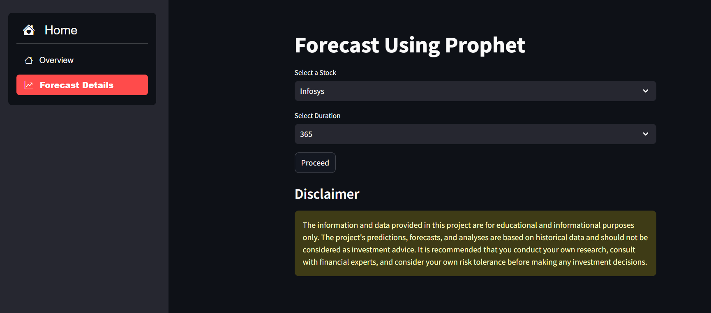

# Time Series Forecasting with Prophet
=====================================

### Live Demo
-------------

## Overview
------------

This project utilizes Facebook's Prophet library to forecast stock prices using time series analysis. Prophet is a popular open-source software for forecasting time series data.

## Features
------------

* Time series forecasting using Prophet library
* Stock price data analysis
* Historical data visualization
* Future price prediction
* Configurable parameters for customization

## Requirements
---------------

* Python 3.x
* Prophet library
* Pandas library
* Matplotlib library
* yfinance library (for stock data)

## Installation
---------------

1. Clone the repository: `git clone https://github.com/Debopam-Pritam2014/time-series-forecasting-using-prophet.git`
2. Install required libraries: `pip install -r requirements.txt`
3. Run the application: `python app.py`

## Usage
---------

1. Select a stock symbol
2. Choose a time frame for historical data
3. Run the forecasting model
4. Visualize historical and forecasted data

## Configurable Parameters
-------------------------

* Time series frequency (daily, weekly, monthly)
* Forecast horizon (days, weeks, months)
* Seasonality mode (additive, multiplicative)

## Stock Data Sources
---------------------

* Yahoo Finance (via yfinance library)

## License
---------

This project is licensed under the MIT License.

## Acknowledgments
------------------

* Facebook for developing the Prophet library
* Yahoo Finance for providing real-time stock data

## Contact
----------

For any questions or suggestions, please contact [Your Name] at [letsdecode2014@gmail.com].

### Requirements.txt
- prophet
- pandas
- matplotlib
- yfinance

